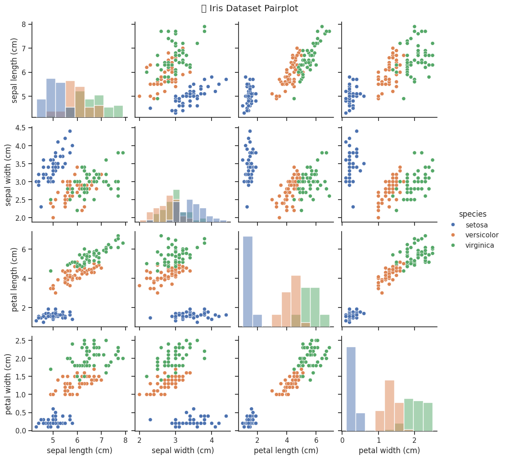

# 🌸 Iris Flower Classification | Logistic Regression & Decision Tree | Scikit-learn

This machine learning project focuses on classifying iris flowers into three species — Setosa, Versicolor, and Virginica — using classical supervised learning models. The goal is to predict the species based on sepal and petal measurements. The project demonstrates model building, evaluation, and visualization using Python and Scikit-learn.

---

## 📊 Dataset
- **Source**: Built-in `sklearn.datasets.load_iris`
- **Size**: 150 samples, 4 features (numerical), 3 species
- **Features**: Sepal Length, Sepal Width, Petal Length, Petal Width

---

## 🔧 Technologies Used
- Python 3
- Pandas
- NumPy
- Scikit-learn
- Seaborn
- Matplotlib

---

## 🧠 Models Implemented
- ✅ Logistic Regression
- ✅ Decision Tree Classifier

---

## 📈 Evaluation Metrics
- Accuracy Score
- Confusion Matrix
- Classification Report

---

## 📊 Visualizations
- Pairplot using Seaborn to analyze feature separability
- Confusion matrix to evaluate prediction performance

### 📸 Sample Outputs

#### 🔍 Pairplot


#### 📉 Confusion Matrix


---

## ✅ Results
| Model               | Accuracy |
|---------------------|----------|
| Logistic Regression | 96.6%    |
| Decision Tree       | 97.3%    |

- Confusion Matrix and Classification Report showed excellent class-wise performance across all 3 flower types.

---

## 📚 Key Learnings
- Supervised classification pipeline (EDA → Preprocessing → Modeling → Evaluation)
- Handling categorical labels using `LabelEncoder`
- Visualization for better feature understanding
- Comparing different model performances

---

## 📂 File Structure

```
├── Iris_Classification_Colab.ipynb    # Main notebook with code and output
├── images/
│   ├── pairplot.png                   # EDA visualization
│   └── confusion_matrix.png          # Prediction result visualization
├── README.md                          # Project documentation
```

---

## ⚙️ How to Run

1. Clone this repository:
```bash
git clone https://github.com/shivamjha-9/iris-classification-ml.git
```

2. Open the notebook in [Google Colab](https://colab.research.google.com/github/shivamjha-9/iris-classification-ml/blob/main/Iris_Classification_Colab.ipynb)

3. Run all cells to see model training, results, and visualizations.

---

## 🔗 Run in Google Colab
[👉 Click here to open in Colab](https://colab.research.google.com/github/shivamjha-9/iris-classification-ml/blob/main/Iris_Classification_Colab.ipynb)

---

## 👤 Author

**Shivam Kumar Jha**  
🎓 B.Tech CSE | GEC Samastipur (Batch of 2027)  
🔗 [LinkedIn](https://www.linkedin.com/in/shivam-jha-a80825291)  
🐙 [GitHub](https://github.com/shivamjha-9)

---

## 📌 Status
✅ Project Completed

---

## 📝 License
This project is open-source and available under the [MIT License](LICENSE).
